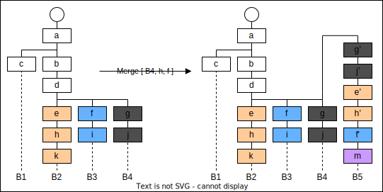

# GOOSVC: Generative AI Version Control
## Introduction
In many applications, we have artifacts such as code, texts, or images. Traditional version control systems help us manage the versions of these artifacts. In generative AI applications, artifacts are generated by interacting with an AI model. For each artifact version, there exists a conversation that created this artifact.

GOOSVC helps you version both the artifacts **and** the conversations. For any version of an artifact, you can extract the conversation used to create it. This is even possible when you use multiple AI models in parallel to create an artifact. As shown in the figure below, users will typically not interact directly with GOOSVC. It's a framework that helps YOU to create an application. 


Can't I use git for this? Yes, you can! Give it a try, but don't waste too much time before returning to GOOSVC. You will notice that generative AI application require a fundamental different branching and merging concept and that a system, that knows the difference between conversations and artifacts, simplifies version control for generative AI application dramatically. You can find more arguments and motivations in our publication: [GOOSVC: Version Control for Content Creation with Generative AI](/doc/pdf/GOOSV-core-paper.pdf). Please citate our publication and this repository as follows:

```
@inproceedings{grud2025goosvc,
  title={GOOSVC: Version Control for Content Creation with Generative AI},
  author={Gr{\"u}nert, David and de Spindler, Alexandre and Dellwo, Volker},
  booktitle={Proceedings of the 10th edition of the Swiss Text Analytics Conference},
  year={2025}
}
```

You have the following options to use GOOSVC:

- Access a local instance of GOOSVC &rarr; [Setup GOOSVC-Local](/doc/api/setup-project.md)
- Access or our Web-API at goosvc.com. &rarr; [Setup GOOSVC-Web](/doc/api/setup-project.md)
- Directly use the low-level API of the core module. &rarr; [Setup GOOSVC-Core](/doc/api/setup-core.md)

## Versioning Approach
The Figure below presents the core elements of the data model. It consist of an immutable node-based version tree, where every interaction is recorded as a distinct node with associated metadata (e.g., parent node, time stamp, author, committer, and type specific data), an immutable pool for storing generated artifacts, and branches to keep track of all available paths. 


*Data model example showing a version tree with three branches ($b_1$ to $b_3$) containing chat- (c), message- (m), stage- (s) and artifact-nodes (a) with references to the artifact pool.*

### Node Types

-**Chat Nodes**: Add a new chat context to the project for interactions with an AI. Every chat context has a unique ID later used by messages and artifacts to declare their affiliation. Chats can be started either from scratch or with a parent by referring to a message node. Chats with parents are interpreted as a continuation from the referenced message.

-**Message Nodes**: Store prompt-response pairs that capture the conversational exchange with an AI. All messages must be associated with a chat context.

-**Artifact Nodes**: Store artifacts (text, images, audio) by referencing the actual data in the artifact pool and defining metadata such as the filename. All artifacts must be associated with a chat context. 

-**Stage Nodes**: Define named project milestones. Stage names must be unique within any path of the version tree. 

-**Merge Nodes**: Document a merge operation of parallel branches. 

-**Transaction Nodes**: Document start and end of a transaction. 

## Owners and Projects
GOOSVC is a multi-user multi-project version control system. Similar to git, each project belongs to an owner. Projects are isolated from each other. Project names must be unique for one user. In opposite to other version control systems, the focus for GOOSVC is **not collaboration**. In most use cases it will be a single user interacting with a project at once in collaboration with AI models. 

Access permissions can be set on project level. If a project is defined as public, all users have read permission. For private projects, only registered users can access the project. For each user read, write and admin permission can be set. Admin permission is needed to add or modify users, to change the visibility (public, private) and to delete the project. 

**Note:** GOOSVC-Core is only responsible for authorization. Authentication is the task of your application.


[Core API for Project](/doc/api/projects.md)

## Nodes and Versions
The version history of a project is stored as a linked list of nodes. Each node has a unique id created by the system. Nodes know the id of the parent node but parent nodes don't know their children. The root node (first node) of a project is the only node without a parent (parent id is None). Nodes contain the following fields:

- `node_id`: ID of the node generated by the system
- `parent_id`: node id of the parent node or None for the first node in a project. Nodes can't have more than one parent.
- `type`: type of the node. Possible values are: `chat`, `message`, `artifact`, `stage`  `merge`, `transaction_start` and `transaction_end`.
- `author`: name of the author 
- `content`: type specific data. See sections below for details.
- `timestamp`: time when the node was stored
- `version`: an ascending version number (version number of the parent plus one). The root node has version 1. Nodes within a transaction share the same verion number.
- `transaction_id`: transaction ID if the node is part of a transaction, None otherwise

Each node id defines an unambiguous version of the project. For a given node id, the corresponding version of the project is defined by the union of all nodes in the path from the node with the given id to the root. There are as many versions of project as there are nodes. Nodes are **immutable**, they cannot be edited or deleted. Nodes are not added directly, the are created through type specific API calls (like [add chat](/doc/api/chats.md#creating-an-empty-chat), [add message](/doc/api/chats.md#adding-messages-to-a-chat) etc.). 

[Core API for Nodes](/doc/api/nodes.md)

## Branches
Branches are created automatically when adding nodes. By adding the first node to a project, the first branch is created. Unlike git, branches don't have names, branches only have ids. These branch ids do not represent a version of the project, they are pointers to the last added node of the branch. Whenever a node is added to the branch, this pointer is updated. New branches are created automatically whenever a node is added with a parent that is not the head id of any existing branch.

The purpose of branches in GOOSVC is **very different** compared in other version control systems. It is not about developing a new feature or a bug fix separate from the main branch. Also the idea of having branches for development and for release is not appropriate. Branches in GOOSVC have two different purposes:

- **To create a new pipeline by reusing part of an existing one:** Let’s assume you had conversations with AI models to create some artifacts. Later you notice that you should have taken another approach somewhere in the middle. You would then go back to this decision point and branch off from there. By doing so, you don't lose our previous work and you can compare the results in the end. However, you will never merge these branches the have overlapping artifacts. 
- **To parallelize work in a section of a pipeline:** Let's assume you create multiple artifacts in a section of your pipeline which don't have any dependencies. For each artifact you might create multiple version and in the end you decide, which version you want to keep. If the related messages and artifacts are all stored in single, linear history, going back to a previous version of one artifact, also reverts all other artifacts to this version of the history. By creating a branches for each artifact, you can avoid this problem. After creating all required artifacts in separate branches and selecting the version to keep, you merge all these version into a single branch. How this is done in detail is described in section [merging](#merging). You would typically mark start and end of such a section with [stages](#stages).

[Transactions](#transactions) restrict the creation of branches. It is not possible to branch off in the middle of a transaction. For nodes belonging to a transaction, branching is only possible form the last node of the transaction.

[Core API for Branches](/doc/api/branches.md)

## Chats
Conversations with generative AIs are stored in chats. Each chat is identified by a unique ID created by the system. Chats also have names but those are not necessarily unique. Chats are created by adding a node of type `chat` to the version history. The node contains the following type specific data under the key `content`:

- `chat_name`: chat name
- `chat_id`: chat id
- `parent_chat_node_id`: chat continues from this node. If None, chat has no parent

When prompting a conversation AI like ChatGPT, you often start with some generic instructions, a system prompt. You describe the role of the agent and describe the context. Also some further interactions might be the same for multiple conversations.

If you want to reuse this generic part of the conversation for multiple chats, you can create a chat with `parent_chat_node_id` referring to the message to continue from. The original chat is not modified by this operation but when reading the new chat, you also get all messages from the parent chat starting from the referenced id. Please note: this is not a branch! Both chats exist in the same linear version history but some messages coexist in both chats.

[Core API for Chats](/doc/api/chats.md)

## Messages
Message Nodes store prompt-response pairs that capture the conversational exchange with an AI. All messages must be associated with a chat context. Storing a message requires the chat id to be valid. This means, the version history of the parent node must contain a chat node with the indicated id. The message node contains the following type specific data under the key `content`:

- `chat_id`: chat id
- `request`: prompt sent to the AI assistant
- `response`: received response
- `assistant`: name of the AI assistant
- `request_artifacts`: dictionary of artifacts sent with the request. Values are artifact node Ids, key can be any string.
- `response_artifacts`: dictionary of artifacts received with the response. Values are artifact node Ids, key can be any string.

[Core API for Messages](/doc/api/messages.md)

## Artifacts
Artifacts can be created through conversations with AI models, but they might also come from an external source. No matter where they come from, both types of artifacts are stored in the same way. When storing an artifact in GOOSVC, a node of type `artifact` is added to the version history and the content of the artifact is saved as a blob. The node contains the following type specific data under the key `content`:

- `chat_id`: chat id
- `artifact_id`: id of the artifact, used as reference to the blob
- `operation`: possible values are: `add`, `update`, `rename`  or `delete`. 
- `filename`: filename for checkout including suffix
- `path`: path for checkout
- `filehash`:  hash of the file 
- `media_type`: media type of the file
- `scope`: scope of the artifact: chat (default) or global
- `origin`: optional parameter to declare the origin of the artifact

Fields artifact_id, filehash, media_type and origin are all `None` for nodes with operation `delete`. For operation `rename`, field origin contains the previous path and filename. For operations `add` and `update` your application can decide how to use the field `origin`.

If the version history contains multiple artifact nodes with the same combination of path and filename, the latest node masks all older ones. For any version of a project, only one artifact for a given path-filename combination is visible. If the last node for a given path-filename combination has operation delete, there is no such artifact in the respective version.

[Core API for Artifacts](/doc/api/artifacts.md)

## Merging
Merging is used to combine the work of a parallelized section of a pipeline (see section  [branches](#branches)). The merge operation takes a list merge heads consisting of branch and node ids as input (B4, h and f in the example below). It adds a new branch (B5) from the first common ancestor (d) and creates a linearized version of all nodes between the merge heads and the common ancestor (g' to f').



The merge operation inserts an additional node (m) to mark the end of the merge. This node is of type `merge` and contains the following type specific information under the key `content`:

- `common_parent_id`: id of the first common ancestor (id of d in the example above)
- `head_ids`: a list with all merge head ids (ids of j, h and f in the example above)
- `node_id_dict`: a dictionary with a key for each node id in the new branch containing the node id of the corresponding original node or None, if there is no such node. For the example above: (g',g), (j',j), (e',e), (h',h) and (f',f). The merge node itself is not included.

During merge, two different types of conflicts can occur:

- **Artifact conflicts:** The same artifact is modified in two or more branches between merge head and the common parent.
- **Chat conflicts:** The same chat is continued in two or more branches between merge head and the common parent.

Chat conflicts are resolved as follows: the system splits the dialogue automatically into two chats with a shared history before the first common ancestor. This approach ensures that the context of every conversation remains intact, even when the content diverges. 

The resolution of artifact conflicts depends on the file type. For text files, the system may automatically merge the changes, if independent sections were modified. For binary files, the system will rename the files. Both cases may require manual review of the result. In general, merge conflicts on artifacts should be avoided. For most situations, parallelized work only makes sense if the work is independent.

[Core API for Merging](/doc/api/merge.md)


## Stages
A stage refers to (exactly) one version within the version history. Stages are used to indicate the **end** of something, for instance the end of a phase within a conversation. Stages help to go back to a certain position within a pipeline. Going back means to continue the work **before** the stage.

Stages have a unique name. It is not possible to insert a stage if the history (the path) already contains a stage with the same name. But, stages are not unique within a project. Different branches can contain stages with the same name. Therefore, stages limit merging. Merging is not possible when there is one or more stage between any of the merge heads and the common parent. There is no way to overcome this restriction. Stages are saved as nodes in the version history. The node contains the following type specific data under the key `content`:

- `stage_name`: name, must be unique within the history
- `stage_description`: description or any application specific data related with the stage

Stages are immutable. It is not possible to modify or delete a stage from the history. The only way to get rid of a stage is to branch off before the stage.

[Core API for Stages](/doc/api/stages.md)


## Transactions
Transactions are used to group multiple nodes. For example, to store the conversational exchange with an AI assistant, one message node and multiple artifact nodes must be stored (one artifact node for each artifact generated by the assistant). All these nodes belong together and it should not be possible to tear them apart. Transactions are used to prevent this. All nodes within a transaction have the same version number and branching off is only possible from the last element of a transactions

[Core API for Transactions](/doc/api/transactions.md)


